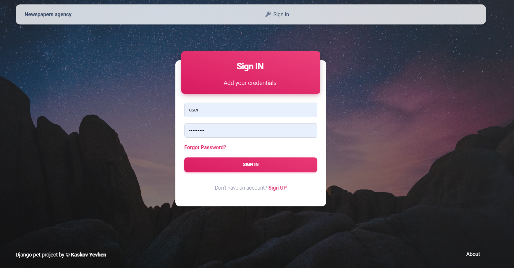
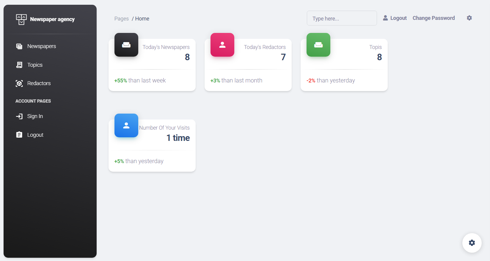
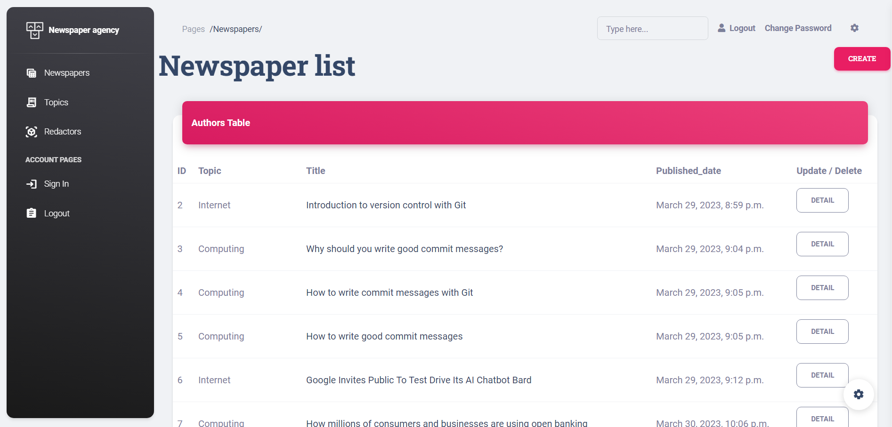

# Newspaper agency

Django project for managing topics, newspapers and redactors.

## Features

* Authentication functionality for Redactor/User
* Managing newspaper redactors and topics directly from website interface (Create / Update / Delete all data) 
* Powerful admin panel for advanced managing


## Check it out

[Newspaper agency project to ...](https://)

```shell
# authentication to view capabilities
username: user
password: poi123123
```

## Installation 
Python3 must be installed

A quick introduction of the minimal setup you need to get a Newspaper agency up &
running.

```shell
git clone https://github.com/inrock1/newspaper_agency
python -m venv venv
venv\Scripts\activate # (on Windows)
source venv/bin/activate # (on macOS)
pip install -r requirements.txt
python manage.py makemigrations
python manage.py migrate
python manage.py createsuperuser
python manage.py runserver # starts Django Server
```

Here you should say what actually happens when you execute the code above.


## Demo







Thanks to [appseed.us](href="https://appseed.us) for frontend template.